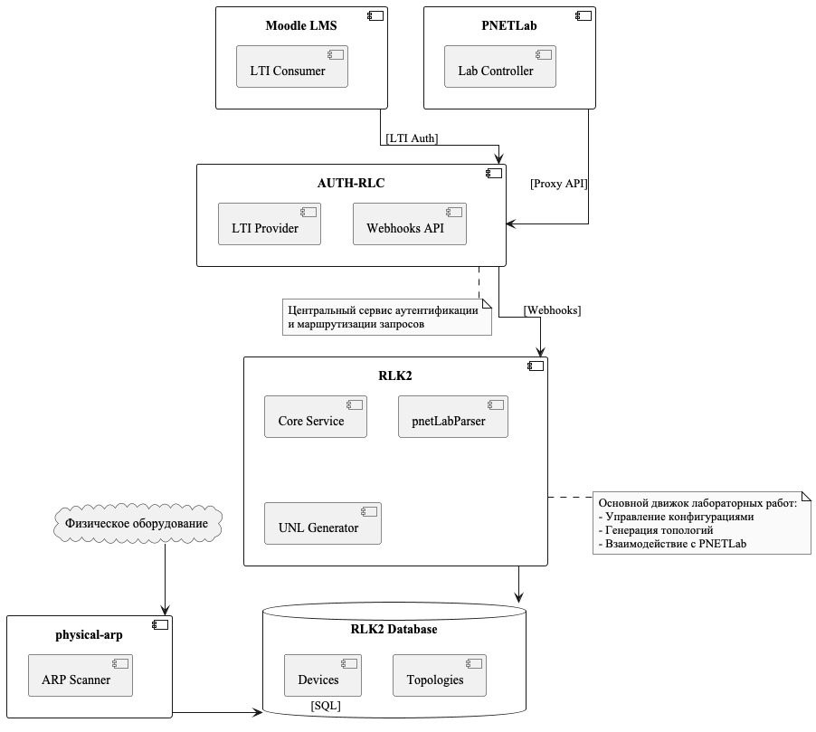

# 🚀 Network Lab Automation System

[Swagger UI](http://localhost:5000/api/docs)

Система автоматизации управления сетевыми лабораторными стендами с REST API и веб-интерфейсом

## 🌐 Архитектура системы

### Компонентная диаграмма



### Последовательность работы


## 🔍 О проекте

Профессиональное решение для автоматизации сетевых лабораторий, позволяющее:

- ⚡ **Автоматизировать** настройку VLAN на коммутаторах через Ansible
- 🖥️ **Визуализировать** состояние оборудования через интуитивный веб-интерфейс
- 🔄 **Управлять** конфигурациями через REST API
- 🔒 **Резервировать** и освобождать сетевое оборудование

## ✨ Основные возможности

### 🛠️ Автоматизация настройки VLAN

- Генерация Ansible playbook на основе топологии
- Поддержка многопользовательского режима
- Шаблоны конфигураций для различных вендоров

### 📊 Управление оборудованием

| Функция              | Описание                                      |
|----------------------|-----------------------------------------------|
| Резервирование       | Бронирование устройств для лабораторных работ |
| Освобождение         | Автоматический возврат в пул                  |
| Мониторинг состояния | Отслеживание статусов (Active/Free/Error)     |

### 🌐 REST API Endpoints

```yaml
POST /api/run_lab    - Запуск лабораторной работы
POST /api/clear_db   - Очистка конфигурации
GET  /               - Получение состояния оборудования
```

## 🚀 Быстрый старт

### Запуск лабораторной работы

```bash
curl -X POST http://localhost:5000/api/run_lab \
  -H "Content-Type: application/json" \
  -d '{"lab_number": 1, "vendor": "Cisco", "group_id": 101}'
```

### Очистка конфигурации

```bash
curl -X POST http://localhost:5000/api/clear_db \
  -H "Content-Type: application/json" \
  -d '{"group_id": 101}'
```

### Просмотр состояния оборудования

```bash
curl http://localhost:5000/
```

## 📊 Пример ответа API

```json
{
  "status": "success",
  "message": "Lab 1 started for group 101",
  "devices_allocated": [
    "SW1",
    "RTR1"
  ]
}
```

## 📚 Технологии

- **Backend**: Python (Flask)
- **Automation**: Ansible
- **Database**: SQLite
- **Frontend**: HTML5, CSS3, JavaScript