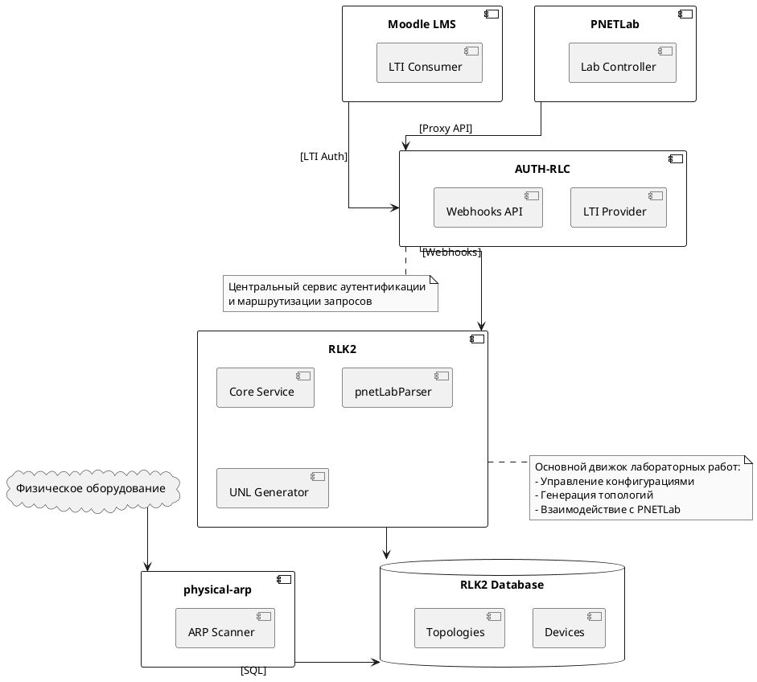
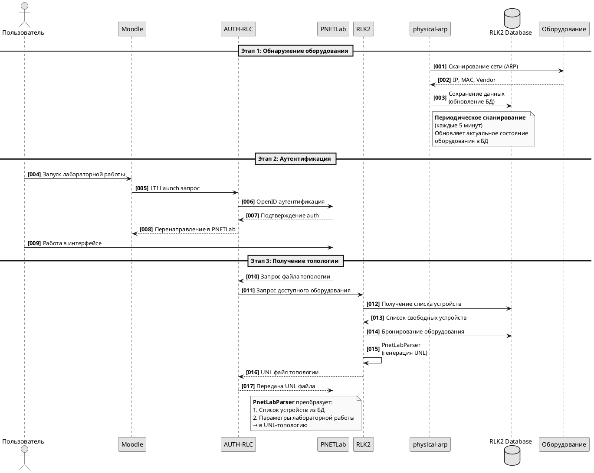

# 🚀 Network Lab Automation System

Система автоматизации управления сетевыми лабораторными стендами с REST API и веб-интерфейсом

## 🌐 Архитектура системы

### Компонентная диаграмма


```plantuml
@startuml Компонентная диаграмма системы
skinparam shadowing false
skinparam monochrome true
skinparam linetype ortho
skinparam defaultFontName "Times New Roman"

component "Moodle LMS" as moodle {
  [LTI Consumer]
}

component "AUTH-RLC" as auth_rlc {
  [LTI Provider]
  [Webhooks API]
}

component "RLK2" as rlk2 {
  [Core Service]
  [pnetLabParser]
  [UNL Generator]
}

database "RLK2 Database" as rlk2_db {
  [Devices]
  [Topologies]
}

component "physical-arp" as physical_arp {
  [ARP Scanner]
}

component "PNETLab" as pnetlab {
  [Lab Controller]
}

cloud "Физическое оборудование" as devices

' Связи
moodle ---> auth_rlc: [LTI Auth]
auth_rlc ---> rlk2: [Webhooks]
rlk2 ---> rlk2_db
physical_arp -> rlk2_db: [SQL]
pnetlab ---> auth_rlc: [Proxy API]
devices --> physical_arp

note bottom of auth_rlc
  Центральный сервис аутентификации
  и маршрутизации запросов
end note

note bottom of rlk2
  Основной движок лабораторных работ:
  - Управление конфигурациями
  - Генерация топологий
  - Взаимодействие с PNETLab
end note
@enduml
```

### Последовательность работы


```plantuml
@startuml Последовательность работы системы

skinparam shadowing false
skinparam monochrome true
skinparam linetype ortho
skinparam defaultFontName "Times New Roman"

actor Пользователь as user
participant Moodle
participant "AUTH-RLC" as auth
participant "PNETLab" as pnet
participant "RLK2" as rlk2
participant "physical-arp" as arp
database "RLK2 Database" as db
participant "Оборудование" as devices

autonumber "<b>[000]"

== Этап 1: Обнаружение оборудования ==
arp -> devices: Сканирование сети (ARP)
devices --> arp: IP, MAC, Vendor
arp -> db: Сохранение данных\n(обновление БД)

note right of arp
  <b>Периодическое сканирование</b>
  (каждые 5 минут)
  Обновляет актуальное состояние
  оборудования в БД
end note

== Этап 2: Аутентификация ==
user -> Moodle: Запуск лабораторной работы
Moodle -> auth: LTI Launch запрос
auth -> pnet: OpenID аутентификация
pnet --> auth: Подтверждение auth
auth --> Moodle: Перенаправление в PNETLab
user -> pnet: Работа в интерфейсе

== Этап 3: Получение топологии ==
pnet -> auth: Запрос файла топологии
auth -> rlk2: Запрос доступного оборудования
rlk2 -> db: Получение списка устройств
db --> rlk2: Список свободных устройств
rlk2 -> db: Бронирование оборудования
rlk2 -> rlk2: PnetLabParser\n(генерация UNL)
rlk2 --> auth: UNL файл топологии
auth --> pnet: Передача UNL файла

note left of rlk2
  <b>PnetLabParser</b> преобразует:
  1. Список устройств из БД
  2. Параметры лабораторной работы
  → в UNL-топологию
end note
@enduml
```

## 🔍 О проекте

Профессиональное решение для автоматизации сетевых лабораторий, позволяющее:

- ⚡ **Автоматизировать** настройку VLAN на коммутаторах через Ansible
- 🖥️ **Визуализировать** состояние оборудования через интуитивный веб-интерфейс
- 🔄 **Управлять** конфигурациями через REST API
- 🔒 **Резервировать** и освобождать сетевое оборудование

## ✨ Основные возможности

### 🛠️ Автоматизация настройки VLAN

- Генерация Ansible playbook на основе топологии
- Поддержка многопользовательского режима
- Шаблоны конфигураций для различных вендоров

### 📊 Управление оборудованием

| Функция              | Описание                                      |
|----------------------|-----------------------------------------------|
| Резервирование       | Бронирование устройств для лабораторных работ |
| Освобождение         | Автоматический возврат в пул                  |
| Мониторинг состояния | Отслеживание статусов (Active/Free/Error)     |

### 🌐 REST API Endpoints

```yaml
POST /api/run_lab    - Запуск лабораторной работы
POST /api/clear_db   - Очистка конфигурации
GET  /               - Получение состояния оборудования
```

## 🚀 Быстрый старт

### Запуск лабораторной работы

```bash
curl -X POST http://localhost:5000/api/run_lab \
  -H "Content-Type: application/json" \
  -d '{"lab_number": 1, "vendor": "Cisco", "group_id": 101}'
```

### Очистка конфигурации

```bash
curl -X POST http://localhost:5000/api/clear_db \
  -H "Content-Type: application/json" \
  -d '{"group_id": 101}'
```

### Просмотр состояния оборудования

```bash
curl http://localhost:5000/
```

## 📊 Пример ответа API

```json
{
  "status": "success",
  "message": "Lab 1 started for group 101",
  "devices_allocated": [
    "SW1",
    "RTR1"
  ]
}
```

## 📚 Технологии

- **Backend**: Python (Flask)
- **Automation**: Ansible
- **Database**: SQLite
- **Frontend**: HTML5, CSS3, JavaScript